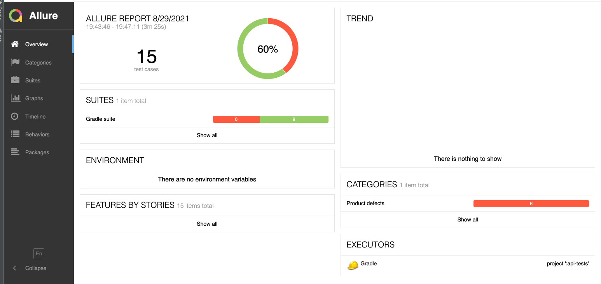

# Description
Basic api tests for jsonplaceholder https://jsonplaceholder.typicode.com/

# Environment
* Java 8+
* Gradle

# Additional plugins 
* Lombok
* Rest-assured
* TestNG
* Allure
* AssertJ

# Execution
* locally via IDE
* using Gradle
```
gradle test
```

# How to generate report
Get test report after test execution
will be located here jsonplaceholder-tests/api-tests/build/reports/allure-report

```
 gradle allureReport 
```
 or 
 ```
 allure serve allure-results
```
Latest report:



All failed tests related to issues (marked @Issue in tests)

# TODO
* add BDD support (e.g Cucumber)
* extend existing coverage
* add Spring
* add more detailed logging by @Slf4j

# Troubleshooting

- make sure that JDK at least java8
- clean gradle daemon
```
gradle --stop
```
- invalidate cache and restart
- try 
```
gradle build
```

#Postman collection
Can be found by link https://www.getpostman.com/collections/0ccf1f60ed142fac23a7
or as json at ./jsonplaceholder-tests/JsonPlaceholder collection.postman_collection.json


